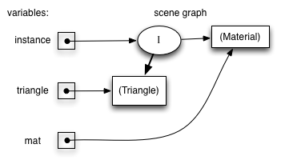
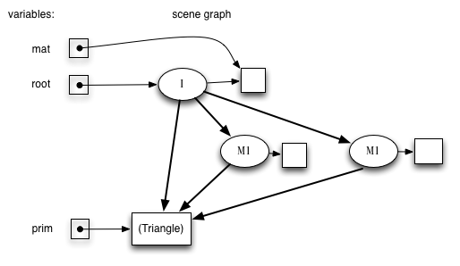

# ssg

A simple scene graph for OpenGL 3.  Uses glm 0.9.5.1 for vector and matrix support.

The file include/_ssg.h has the main class definitions.
ModelNodes are grouped into a DAG with a single root.
There must be at least one Primitive if anything is to actually get drawn. They encapsulate the data and shaders used.
Instances group and transform their children ModelNodes.

# Environment
The SSG_DATA environment variable must be set to the location of ssg's "data" directory.
Filenames of obj files and shaders should be there. If not, the current directory is tried.
For example, if you installed ssg in the Software directory of your home directory, in ~/.bashrc, add:

    export SSG_DATA=$HOME/Software/ssg/data

# Graph Nodes

## ModelNode
This is the base class for nodes (Instances and Primtives) in a scene graph. It has methods init(), draw() and update().
## Primitive 
The primitive handles the OpenGL vertex arrays, and draws them. It is always a leaf node of the graph.
Primitives are stored in a vertex array with position, normal, texture coordinates for each vertex,
A list of indices to use when drawing (done with a call to glDrawElements()) is kept in an element array.
## Instance
Instances have one or more children ModelNodes (Instances and/or Primitives). 
Instances also have a matrix that is right-multiplied to the given modelview matrix before drawing the children.
## ParticleSystem
ParticleSystems are Primitives that render a collection of particles under acceleration.
## ObjFilePrimitive
This is a Primitive that reads most .obj (Wavefront) files.  Material import is a bit dicey at the moment.
If using Blender, be sure to give the object a material and export the materials and normals.
## Triangle
A simple Primitive.
## Marker
A simple Primitive.

# Other Classes
## Material
Any ModelNode can have an attached Material.  The first Material encountered on the path from the root to a primitive
is used to draw the primitive.  The material parameters are passed as glUniforms to shaders.  Basically a Phong
model, with diffuse textures and bumpmapping.
## Camera
Cameras support a trackball interaction if you supply them with mouse events (see the first examples).  They
handle the root modelview and projection matrices if you pass the root to the camera's draw() method.
Call the camera's setupPerspective() in reshape() to setup basic modelview and projection matrices.
## Texture
Textures can be read from files, associated with Materials, and bound to FrameBufferObjects (for rendering to the texture).

# Examples
## example0.cpp
This is about the simplest SSG program possible, it creates a Triangle Primitive,
and makes it the child of an Instance node.  The Instance has it's matrix set to the identity,
and is given a Material.

GLUT callbacks for mouse and motion events give the default Camera a trackball behavior.

Here's the graph it creates:

## example1.cpp
This example shows how a .obj file can be read in and used as a Primitive.
The filename is given on the command line, for example (assuming your SSG_DATA environment variable is set correctly):

    ./example1 objfiles/cube.obj

## example2.cpp
This takes an obj file as a command line parameter.
Starting with a single instance of a primitive as in the previous examples,
this program will, on pressing the 'a' key,
add a new instance as a child of the root node.
The new instance shares its primitive with that of the root instance.
The new instance's matrix is set to a randomly selected translation and rotation,
and its material is set to a new, randomly initialized material.

Here's what the scene graph looks like after adding two new instances.
(M1 and M2 are the matrices stored at the Instance nodes.)

## example3.cpp
This takes an obj file as a command line parameter.
This example adds a new instance of a particle system with a random translation whenever the 'a' key is pressed.
Each new instance refers to a new ParticleSystem primitive with a different material.
The color of the material is chosen as a combination of the "center color" (yellow)
and "rim color" (red) to give a fiery appearance when multiple systems are created.

## example4.cpp
Taking an obj filename on the command line,
this example displays it using a camera scripted
to track from a given starting position to an ending position, 
using linear interpolation.
The starting and ending times of the motion are given.
The trackball has to be disabled for this to work.

For each frame, the current time is determined (now).
If its not yet thime to start the motion,
the camera's position is set to the starting position.
If the motion is over (its now past the ending time),
the camera is set to the final position.
For times between the starting and ending times, a parameter u, between 0.0 and 1.0,
is computed by dividing the current offset from the starting time by the duration of the
motion.  This value of u is then used to linearly interpolate a camera position
between the starting and final positions.

## example5.cpp
Loads a "baked animation" consisting of a directory full of .obj files, one per frame.
These can be exported from Blender, for example.
Each object is loaded into separate primitives,
then drawn one-by-one for each frame of playback.

## example6.cpp
Shows how to do a quadratic interpolation of an instance as nested linear interpolations, after DeCasteljau.

## example7.cpp
Shows using DeCasteljau for cubic interpolation.

## example8.cpp
Shows cubic interpolation of postition with linear interpolation of orientation with Euler angles 

## example9.cpp
Shows an animated, articulated arm attached to a base.

## example10.cpp
Shows an animated, articulated biped.

## depthrender.cpp
This uses a shader that sets the color based on fragment depth in eye coordinates.

## discardfragments.cpp
This uses a shader that drops fragments using a noise function.

## gimbal-lock.cpp
This illustrates the gimbal-lock problem encountered when interpolating Euler angle representations of orientation.

## postprocess.cpp
This shows how an effect chain can be built from a cascade of FrameBuffer objects.
